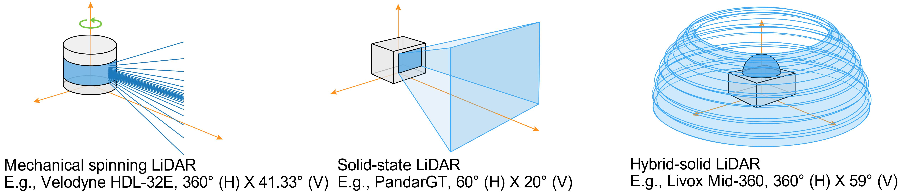
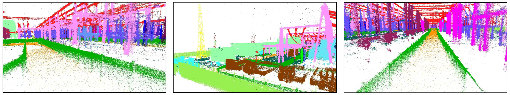

# SFPNet: Sparse Focal Point Network for Semantic Segmentation on General LiDAR Point Clouds 

This repo is the official project repository of the paper **[\[SFPNet\]](http://arxiv.org/abs/2407.11569)** (ECCV 2024) and dataset **[\[S.MID\]](https://www.semanticindustry.top)**.

## 1. Overview
**SFPNet**: 
For the backbone of **LiDAR** segmentation task, the three main challenges it needs to address are **sparsity**, **large scale**, and **non-uniform changes in point cloud density**. 
Previous works introduced inductive bias (special partition or special window and position encoding) to a single type of LiDAR (usually mechanical spinning LiDAR) to solve the 
above three challenges . This can limit model **generalizability** to other kinds of LiDAR and make hyperparameter tuning more complex.
 Therefore, we propose the pipeline SFPNet with favorable properties (See more in our  [paper](http://arxiv.org/abs/2407.11569)) to address the three main challenges in various type of LiDAR
  point cloud data while avoiding the introduction of special inductive bias. Our core module SFPM can replace window transformer block.

Comparison of field of view:

Comparison of cumulative point clouds:


**S.MID**:
We used an industrial robot (equipped with Livox Mid-360) to collect a total of 38904 frames of **hybrid-solid LiDAR** data in different substations. 
We annotated 25 categories under professional guidance and merged them into 14 classes for single-frame segmentation task. 

Examples of labeled cumulative point clouds in [S.MID](https://www.semanticindustry.top/dataset):


The S.MID dataset is published under CC BY-NC-SA 4.0 license, which means that anyone can use this dataset for non-commercial research purposes.

You can quickly get an overview of our work through a short [video](https://www.youtube.com/watch?v=3AA-p0JUuxk).
## 2. SFPNet

### 2.1 Environment
Download and create environment.
```
git clone https://github.com/Cavendish518/SFPNet.git
conda create --name sfpn python=3.9
conda activate sfpn
```
Install dependencies.
```
pip install torch==1.8.0+cu111 torchvision==0.9.0+cu111 torchaudio==0.8.0 -f https://download.pytorch.org/whl/torch_stable.html
pip install torch_scatter==2.0.9
pip install torch_geometric==1.7.2
pip install spconv-cu114==2.1.21
pip install torch_sparse==0.6.12 cumm-cu114==0.2.8 torch_cluster==1.5.9
pip install tensorboard timm termcolor tensorboardX
pip install numpy==1.25.0
```
Note: The versions of some libraries are not very strict and can be adjusted according to the requirements file.
### 2.2 Quick Demo
**Demo for S.MID**:
```
python demo_SMID.py --config config/demo/Mid_demo.yaml
```

**Model weights library**

| dataset         |        Val mIoU (tta)         |                                                  Download                                                  |
|-----------------|:-----------------------------:|:----------------------------------------------------------------------------------------------------------:|
| S.MID_v1.3      |       72.8  (new baseline)        |    [S.MID baseline](https://drive.google.com/file/d/1vn2-Uew3W7c7jZB-dDxgzw7w-VruW7bi/view?usp=sharing)    |
| S.MID_beta_v1.2 | 71.9 (original paper version) |    [S.MID Weight2](https://drive.google.com/file/d/1hvTmEdBdYSe-Rjgc-S9et9P5F5XdAB56/view?usp=sharing)     |
| nuScenes        |             80.1              |   [nuScenes Weight](https://drive.google.com/file/d/1ovEpw6_1km28FM_YmHGwbs0ShUVraL4t/view?usp=sharing)    |
| SemanticKITTI   |             69.2              | [SemanticKITTI Weight](https://drive.google.com/file/d/1xoXseXGDKtNC4dm2axb_8u9rxzNS1Qe_/view?usp=sharing) |

If your are using a newer GPU, please refer to [issue#4](https://github.com/Cavendish518/SFPNet/issues/4).

###  2.3 ROS Tools
To facilitate the use of LiDAR semantic segmentation in downstream tasks, we provide ROS tools.

###  2.4 Training
Please note that our work focuses on the representational capabilities of the network design itself. Therefore, related powerful training techniques (novel data augmentation, post-processing
 and distillation) have not been used in the experiments. But these are important parts of research. So we encourage you to try related techniques. We will be happy if you train better model 
 weights. If you are willing to make the model weights and codes public, please contact us.

## 3. SeMantic InDustry 
Download S.MID from **[\[S.MID\]](https://www.semanticindustry.top/download)**. Details about dataset can be found in the [webpage](https://www.semanticindustry.top) and our [paper](http://arxiv.org/abs/2407.11569). 
An optimized and denoised version v1.3 has been released (see [issue#1](https://github.com/Cavendish518/SFPNet/issues/1)).

For constructing the code for dataloader, you can refer to the implementation in the demo.

Additional dependencies for dataset tools.
```
pip install matplotlib
pip install open3d
```
Statistics of label distribution.
```
python Mid_label_distribution.py /path_to_dataset/SMID_v1_3/sequences/01
```
Visualization of ground truth (single frame).
```
python Mid_vis_cloud.py --vis_type ground_truth --pt_path /path_to_dataset/SMID_v1_3/sequences/01/hybrid/001000.bin --gt_path /path_to_dataset/SMID_v1_3/sequences/01/labels/001000.label
```
Visualization of prediction (your prediction in ground truth format). You can modify the code to fit your storage format.
```
python Mid_vis_cloud.py --vis_type prediction --pt_path /path_to_dataset/SMID_v1_3/sequences/01/hybrid/001000.bin --pd_path /path_to_prediction/001000.label
```
Visualization of difference (your prediction in ground truth format). You can modify the parameters for better view.
```
python Mid_vis_cloud.py --vis_type difference --pt_path /path_to_dataset/SMID_v1_3/sequences/01/hybrid/001000.bin --gt_path /path_to_dataset/SMID_v1_3/sequences/01/labels/001000.label --pd_path /path_to_prediction/001000.label
```
## 4. Task list
- [x] Release model code of SFPNet;
- [x] Release S.MID and instruction in our dataset webpage;
- [x] Release code of Demo (validation);
- [x] Release dataset tools;
- [x] Release model weights;
  - [x] S.MID
  - [x] nuScenes
  - [x] SemanticKITTI
- [ ] Release code of training;
- [ ] Release ROS tools.
## 5. Acknowledgements
We would like to thank all the pioneers [SemanticKITTI](https://github.com/PRBonn/semantic-kitti-api), [FocalNet](https://github.com/microsoft/FocalNet), [SphereFormer](https://github.com/dvlab-research/SphereFormer/tree/master), [Cylinder3D](https://github.com/xinge008/Cylinder3D) and [nuScenes](https://github.com/nutonomy/nuscenes-devkit). 

## 6. Citation
If your like our paper, codes or dataset, please cite us and give this repo a star.
```
@inproceedings{wang2025sfpnet,
  title={Sfpnet: Sparse focal point network for semantic segmentation on general lidar point clouds},
  author={Wang, Yanbo and Zhao, Wentao and Cao, Chuan and Deng, Tianchen and Wang, Jingchuan and Chen, Weidong},
  booktitle={European Conference on Computer Vision},
  pages={403--421},
  year={2025},
  organization={Springer}
}
```
